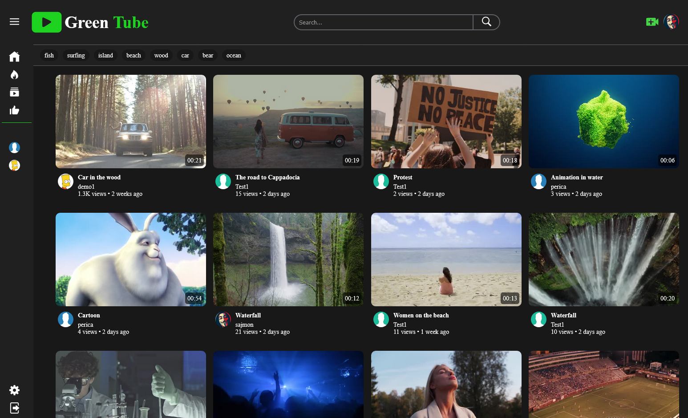
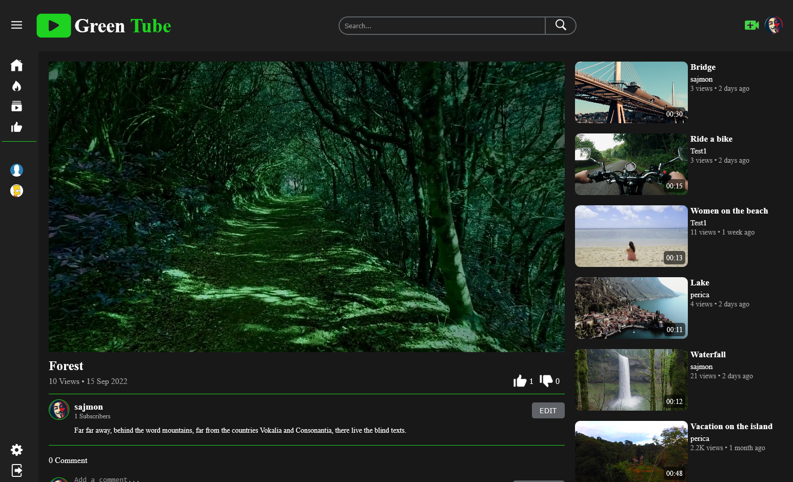
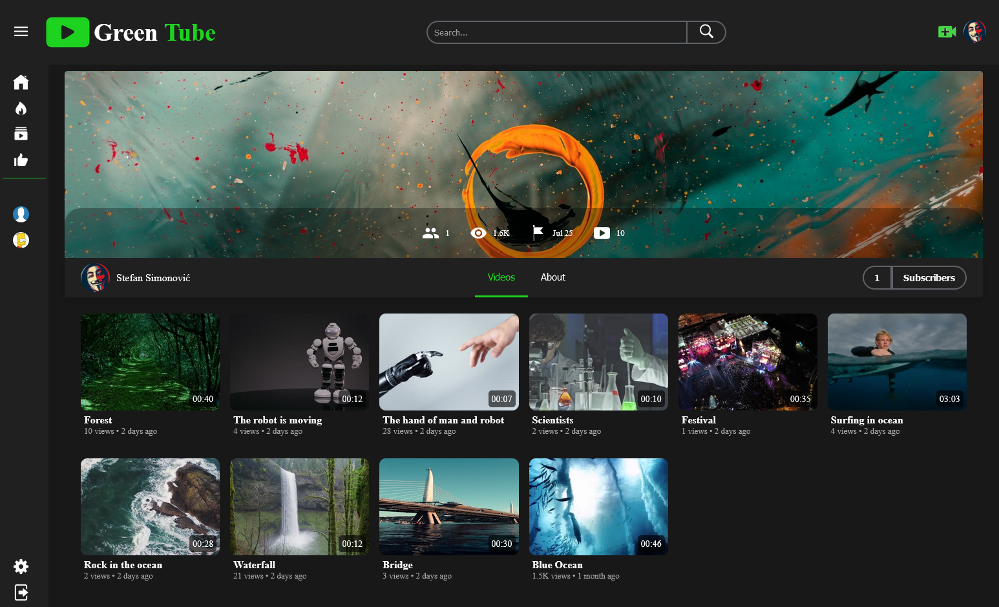

# Green Tube

**Green Tube** is a PHP MVC-based video sharing platform, inspired by popular video platforms. Users can upload, watch, and interact with videos.

## Screenshot

## Features

- **Users:** registration and authentication
- **Video:** upload, streaming, automatic thumbnail generation, video duration extraction
- **Interaction:** likes, dislikes, comments
- **Media processing:** video conversion to MP4 using **ffmpeg**

## Built With

- **Frontend:** HTML5, SCSS, JavaScript
- **Backend:** PHP (MVC), MySQL, PDO
- **Media Processing:** ffmpeg

## Installation / Setup

1. Clone the repository
2. Import the database from `greentube.sql`
3. Configure `config.php` (database credentials and URL root)
4. Start your local server (WAMP, XAMPP, Laragon)
5. Open the application in your browser
